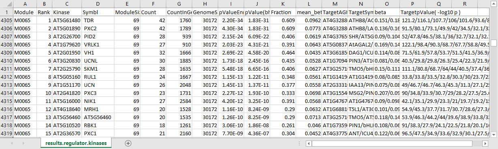

# explicit-kinase

**Identify kinase regulators for gene modules and pathways.**

The EXPLICIT-Kinase package is modified from the [EXPLICIT](https://github.com/MaShisongLab/explicit) package we published previously ([Geng *et al.* 2021](https://github.com/MaShisongLab/explicit-kinase#Reference)). It has been developed to construct an Arabidopsis gene expression predictor, which uses the expression of 974 kinase genes to predict the expression of 30,172 non-kinase genes. It further enables downstream inference of kinase regulators for gene modules functioning in diverse plant pathways. Below is a brief description on how to use the tool. For more details, please refer to the [EXPLICIT](https://github.com/MaShisongLab/explicit) package published previously. 

<a></a>

## Table of Contents
- [Install](https://github.com/MaShisongLab/explicit-kinase#Install)
- [Usage](https://github.com/MaShisongLab/explicit-kinase#Usage)
   - Infer kinase regulators for gene modules
   - Draw chord diagrams for the kinase regulators
   - Create custom gene expression predictor
- [Reference](https://github.com/MaShisongLab/explicit-kinase#Reference)

## Install
This package requires [Perl](https://www.activestate.com/products/perl/downloads/), [R](https://www.r-project.org/), and the [circlize](https://www.rdocumentation.org/packages/circlize/) package in R. 

`circlize` can be installed within an R console via the command:

```R
install.packages("circlize")
```
[MATLAB](https://www.mathworks.com/products/matlab.html) is optional. Only required if you want to create your own predictor model using custom expression data. 

Once the required software is installed, just download or clone the whole package to a local computer and start using it from the package's home directory. 

## Usage

### 1. Infer kinase regulators for gene modules

#### (1). Prepare the module file
The file used to store gene modules information is `modules_to_analyze.txt`. The file has two tab-separated columns, with the first column being gene ids and the second being module names. For gene ids, only standard Arabidopsis AGI ids are supported. Multiple modules can be analyzed at the same time. <i>Once finish editing, save the file without changing its name</i>.
```
Gene_Name   ModuleID
AT1G25360   Module138
AT2G22340   Module138
AT5G75660   Moudle138
AT2G22130   Module139
AT4G12350   Module139
.........   ........
```
#### (2). Conduct enrichment assay to identify kinase regulators for the modules
The Perl script `getArabidopsisRegulatorKinases.pl` will do the job. It takes the modules from the file `modules_to_analyze.txt` to conduct enrichment assays to identify potential kinase regulators. Results are saved to a file named `results.regulator.kinases.txt`.

Open a command line window or shell terminal, navigate to the home directory of the EXPLICIT-Kinase package, and type in the following command:
```shell
perl getArabidopsisRegulatorKinases.pl
```

The resulted file `results.regulator.kinases.txt` can be opened and viewed in EXCEL. It lists the potential kinase regulators for every input modules. Here is an example: 




### 2. Draw chord diagrams for the kinase regulators

The `getChordDiagram` function can be used to draw chord diagrams for the modules in R. The function extracts the significant interacting kinase-non-kinase gene pairs from the file `results.regulator.kinases.txt` for the input module, and then uses these gene pairs to draw a chord Diagram accordingly. It has four input variables:<br>
`module` - the name of the module <br>`ratio` - the relative size of the target gene area occupies <br>`kinasenum` - the maximum number of kinase genes to be included in the diagram <br>`targetnum` - the maximum number of non-kinase target genes to be included in the diagram.<br><br>

Open an R console and change the working directory to the home directory of the EXPLICIT-Kinase package. Within the R console, type in the following commands:
```R
# R code
# Load the scripts that define the getChordDiagram function.
source("Rscripts.R")  

# The function requires the 'circlize' package
library("circlize")

# To draw a chord diagram for Module0105
getChordDiagram( module="M0105", ratio = 1, kinasenum = 50, targetnum = 15)

# Change the relative size of the target gene area
getChordDiagram( module="M0105", ratio = 0.5, kinasenum = 50, targetnum = 15)

# To draw chord diagrams for other modules
getChordDiagram( module="M0084", ratio = 1, kinasenum = 50, targetnum = 15)
getChordDiagram( module="M0081", ratio = 1, kinasenum = 50, targetnum = 15)
getChordDiagram( module="M0105", ratio = 1, kinasenum = 50, targetnum = 15)
```

### 3. Create custom gene expression predictor 

Please refer to the [EXPLICIT](https://github.com/MaShisongLab/explicit#3-create-custom-gene-expression-predictor) package for detailed procedures on how to create your own gene expression predictor. You should replace the TF genes and use the kinase genes instead as regressors to build the predictor model. 

## Reference

Peng Y<sup>#</sup>, Zuo W<sup>#</sup>, Qin Y, and Ma S. 2021. EXPLICIT-Kinase: a gene expression predictor for dissecting the functions of the Arabidopsis kinome. (#co-first author)<br><br>
Geng H<sup>#</sup>, Wang M<sup>#</sup>, Gong J<sup>#</sup>, Xu Y, and Ma S. 2021. An Arabidopsis expression predictor enables inference of transcriptional regulators for gene modules. Plant Journal 107:597-612. (#co-first author)

